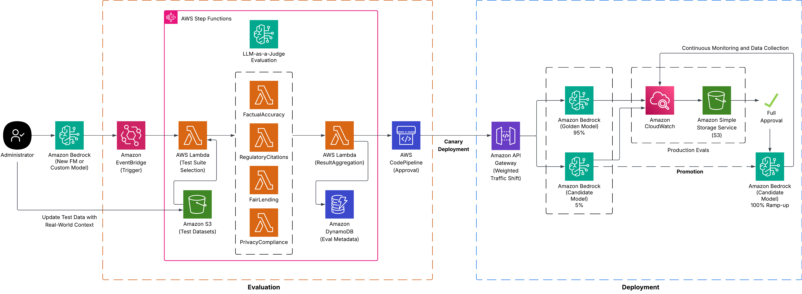

# Model‑Evaluation Pipeline (Left‑Side Stack)

*1/2 of a complete solution for automated, model‑agnostic vetting & approval of LLM candidates before deployment*



---

## Table of Contents

1. [Why this stack exists](#why-this-stack-exists)
2. [High‑level architecture](#high-level-architecture)
3. [Repository layout](#repository-layout)
4. [Prerequisites & bootstrap](#prerequisites--bootstrap)
5. [Deploying the stack](#deploying-the-stack)
6. [Prompt‑wrapper config (model‑agnostic)](#prompt-wrapper-config)
7. [Triggering an evaluation](#triggering-an-evaluation)
8. [Outputs & hand‑off](#outputs--hand-off)
9. [Environment variables & CDK context](#environment-variables--cdk-context)
10. [Extending / hardening](#extending--hardening)
11. [Troubleshooting](#troubleshooting)

---

## Why this stack exists

Regulated industries need an **audit‑ready gate** between "new model release" and "serving live traffic."  This stack runs six evaluations—latency, qualitative LLM‑Judge, factual, regulatory, fair‑lending, privacy—then emits a *ModelApproved* event.  **No code changes** are required to switch model families (Anthropic → Mistral → Llama, or your own fine‑tune) thanks to a **prompt‑wrapper config** stored in S3 + SSM.

---

## High‑level architecture

```text
EventBridge (ModelOpsBus)
   │  NewModelVersion / ModelImported
   ▼
┌────────────────────────────┐
│  Step Functions (Parallel) │
│  ├─ LatencyP95Fn           │
│  ├─ LLMJudgeFn             │
│  ├─ FactualFn              │
│  ├─ RegulatoryFn           │
│  ├─ FairLendingFn          │
│  └─ PrivacyFn              │
└────────────────────────────┘
          │
          ▼
 EventBridge  ➜  Deployment stack      &      SSM / DynamoDB lineage
```

Each Lambda first calls **`wrapPrompt(modelId, rawText)`** (from a shared layer) so prompts are automatically wrapped for the correct chat format (Claude ChatML, Mistral `[INST]`, Llama 3, etc.).

---

## Repository layout

```text
model-eval-pipeline/
├─ assets
│   ├─ img/
│   └─ json/
│       └─prompt-wrappers.json      # Prompt wrapping to upload to s3
├─ bin/evaluation.ts                # CDK entry‑point
├─ lib/evaluation-stack.ts          # Core infra
├─ lambda/                          # 6 evaluator handlers
│   ├─ eval‑factual/index.ts
│   ├─ eval‑regulatory/index.ts
│   ├─ eval‑fairlending/index.ts
│   ├─ eval‑privacy/index.ts
│   ├─ eval‑latency/index.ts
│   └─ eval‑qualitative/index.ts
├─ layer/prompt-utils/              # chat wrapper helper
│   └─ nodejs/node_modules/prompt-utils/
├─ config/ prompt-wrappers.json     # Model‑to‑template mapping
├─ package.json  tsconfig.json  cdk.json
├─ scripts/
│   └─ bootstrap.sh deploy.sh
└─ README.md
```

---

## Prerequisites & bootstrap

| Tool           | Version                                                        |
| -------------- | -------------------------------------------------------------- |
| Node.js        | 18 LTS                                                         |
| AWS CDK        | ≥ 2.139                                                        |
| Docker Desktop | running (for Lambda bundling)                                  |
| IAM perms      | CDK bootstrap, Bedrock `ConverseCommand`, SSM, S3, EventBridge |

```bash
npm i -g aws-cdk@latest
cdk bootstrap aws://$ACCOUNT/$REGION
npm install
```

---

## Deploying the stack

1. **Upload initial prompt‑wrapper file** (or use the sample):

   ```bash
   aws s3 cp assets/json/prompt-wrappers.json s3://modelops-config/prompt-wrappers/v1.json
   ```
2. **Set SSM pointer**

   ```bash
   aws ssm put-parameter \
     --name /modelops/prompt-wrappers/version \
     --type String \
     --value '{"bucket":"modelops-config","key":"prompt-wrappers/v1.json"}'
   ```
3. **Deploy** infra & layer:

   ```bash
   cdk deploy EvalStack
   ```

   CDK outputs the state‑machine ARN, bus ARN, dataset bucket, and layer ARN.

---

## Prompt‑wrapper config

`prompt-wrappers.json` maps regex → `{ prefix, suffix }`:

```jsonc
{
  "rules": [
    { "match": "^anthropic\\.", "prefix": "\\n\\nHuman: ", "suffix": "\\n\\nAssistant:" },
    { "match": "^mistral\\.",   "prefix": "[INST] ",        "suffix": " [/INST]" },
    { "match": "llama|meta",      "prefix": "<<SYS>>\\n",     "suffix": "\\n<</SYS>>" },
    { "match": ".*",              "prefix": "",               "suffix": "" }
  ]
}
```

*This is maintained in a file for independent control over prompt wrapping rules.*

Every evaluator calls:

```ts
import { wrapPrompt }
```

`wrapPrompt` lazily loads & caches the JSON rules from S3 (key provided by SSM) so cold‑start cost is minimal.

---

## Triggering an evaluation

### Custom model import finished

```bash
aws events put-events --entries '[{
  "Source":"bedrock.custom-model",
  "DetailType":"ModelImported",
  "EventBusName": "ModelOpsBus",
  "Detail":"{\"modelArn\":\"arn:aws:bedrock:us-west-2:123456789012:model/myteam.credit-risk\",\"version\":\"2025-05-10\"}"
}]'
```

### Foundation model candidate

```bash
aws events put-events --entries '[{
  "Source":"model-registry",
  "DetailType":"NewCandidateModel",
  "EventBusName": "ModelOpsBus",
  "Detail":"{\"modelId\":\"arn:aws:bedrock:<REGION>:<ACCOUNT_ID>:inference-profile/us.anthropic.claude-3-opus-20240229-v1:0\",\"version\":\"2025-05-09\"}"
}]'
```

---

## Outputs & hand‑off  <a id="outputs--hand-off"></a>

| Artifact                           | Consumer         | Purpose                                               |                       |
| ---------------------------------- | ---------------- | ----------------------------------------------------- | --------------------- |
| `ModelApproved` EventBridge event  | Deployment stack | Shifts API Gateway weights.                           |                       |
| `/modelops/approved/current` (SSM) | Dashboards/infra | Latest approved \`{modelId                            | modelArn, version}\`. |
| DynamoDB `EvalMetadata`            | Audit            | Stores runId, scores, results.                        |                       |
| CloudWatch Logs                    | Debug            | Shows `wrapPrompt` mapping, raw event, scored output. |                       |

---

## Environment variables & CDK context  <a id="environment-variables--cdk-context"></a>

| Name                         | Set on          | Description                                  |
| ---------------------------- | --------------- | -------------------------------------------- |
| `DATASET_BUCKET`             | evaluators      | Offline test corpus location.                |
| `TABLE_NAME`                 | aggregator      | DynamoDB lineage table.                      |
| `EVENT_BUS_ARN`              | aggregator      | Where to emit `ModelApproved`.               |
| `DEFAULT_MODEL_ID`           | evaluators      | Fallback if event lacks modelId.             |
| `rightStackBusArn` (CDK ctx) | `cdk deploy -c` | Re‑use existing bus instead of creating one. |

---

## Extending / hardening  <a id="extending--hardening"></a>

* **Tunable thresholds**: move pass/fail scores to `ssm:/modelops/thresholds.json`.
* **Concurrency**: wrap prompts in SFN `Map` state for large test sets.
* **Observability**: enable X‑Ray, add CW alarms on state‑machine `FAILED`.
* **Security**: restrict `bedrock:InvokeModel` to specific ARNs; encrypt S3 + DynamoDB with KMS.

---

## Troubleshooting  <a id="troubleshooting"></a>

| Symptom                                                          | Likely cause                                                                            | Resolution                                                                                                                                   |
| ---------------------------------------------------------------- | --------------------------------------------------------------------------------------- | -------------------------------------------------------------------------------------------------------------------------------------------- |
| `ValidationException: The provided model identifier is invalid.` | Event `modelId` not available in Region or Wrapper driver falling back to wrong default | List models: `aws bedrock list-foundation-models --region us-west-2 --query "modelSummaries[].modelId"`. Update event or `DEFAULT_MODEL_ID`. |
| `prompt must start with "\n\nHuman:"`                            | Prompt not wrapped; wrapper JSON missing regex                                          | Verify `prompt-wrappers.json` rule matches the modelId; bump SSM pointer.                                                                    |
| Docker build fails during CDK deploy                             | Docker Desktop not running                                                              | Launch Docker Desktop and retry.                                                                                                             |
| State machine succeeds but Deployment stack never shifts         | Deployment stack listening on wrong bus                                                 | Check `ModelOpsBusArn` output and EventBridge rule in right‑side stack.                                                                      |

---

## Adapting to real‑world journeys

| Demo layer                         | Swap‑in alternative                                                  | Why / when                                                    |
| ---------------------------------- | -------------------------------------------------------------------- | ------------------------------------------------------------- |
| **Latency Lambda**                 | Direct SFN SDK → `bedrock-runtime:invokeModel` (Map + IntrinsicMath) | No custom code, fine‑grained cost control.                    |
| **LLM‑Judge Lambda**               | Bedrock **ModelEvaluation** job (`createEvaluationJob`)              | Large datasets, AWS‑managed scoring, audit to S3.             |
| **Fair‑Lending / Privacy Lambdas** | Call Compliance’s existing API (function URL or API GW)              | Keeps policy logic outside DevOps code.                       |
| **Regex heuristics**               | **Bedrock Guardrails Automated Reasoning** (Preview)                 | AWS‑maintained safety & policy checks.                        |
| **prompt‑wrappers JSON**           | DynamoDB or AppConfig                                                | Ops can change chat wrappers instantly without S3 versioning. |

Each swap keeps the `{check, score, passed}` contract, so the aggregator and deployment logic never change.

---

### Need help?

Contact jsmithac or virpadte \[at\] amazon \[dot\] com
